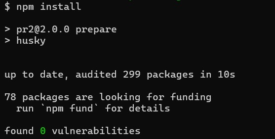
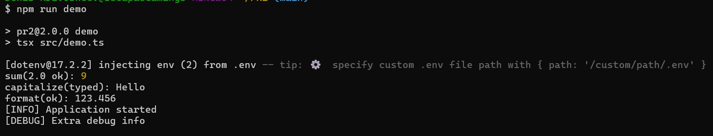
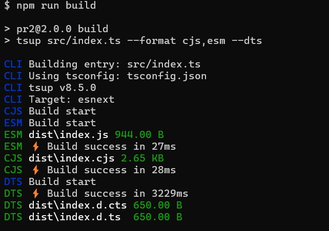

# Practic-2

## 📌 Опис
Проєкт демонструє:
- роботу з `package.json`, залежностями та семантичним версіонуванням (SemVer);
- використання змінних оточення через `.env` + валідацію з `zod`;
- базові можливості TypeScript: типи, інтерфейси, класи, generics;
- налаштування інструментів розробки: **ESLint, Prettier, Husky, Commitlint**;
- поетапний розвиток коду від версії `0.1.0` до `2.0.0`.

---

## Інструкції з запуску

### Встановлення
```bash
git clone https://github.com/DenysKryvosheiev/PR2.git
cd PR2
npm install
```

```bash
npm run demo
```
### Приклад викликів функцій:

```bash
npm run build
```

## Крок 1. Ініціалізація проєкту

створено package.json, .gitignore, базові скрипти;

підключено eslint, prettier, husky, commitlint;

налаштовано tsconfig.json.
## Крок 2. Версія 0.1.0 – прості функції з any

реалізовано add(a: any, b: any) і capitalize(s: any);

продемонстровано відсутність перевірок при any;

eslint і prettier ловлять стилістичні помилки.

## Крок 3. Версія 0.2.0 – базові типи

ті ж функції, але вже з number і string;

з’явилися реальні помилки типів у demo.ts.

## Крок 4. Версія 0.3.0 – складний тип

додано type NumberFormatOptions;

функція formatNumber(value: number, options?: NumberFormatOptions).

## Крок 5. Версія 0.4.0 – інтерфейси + generics

створено інтерфейс User;

додано generic-функцію groupBy<T>(arr: T[], key: keyof T).

## Крок 6. Версія 0.5.0 – клас Logger + .env

створено файл src/config.ts з валідацією змінних через zod;

додано клас Logger з рівнями 'silent' | 'info' | 'debug';

formatNumber тепер бере значення з APP_PRECISION у .env.

## Крок 7. Версія 1.0.0 – стабілізація API

усі публічні експорти зібрані в src/index.ts;

посилено ESLint (заборонено any);

додано поля exports, main, module, types у package.json.

## Kрок 8. Версія 2.0.0 – breaking change

зміна сигнатури add: тепер приймає масив чисел add(values: number[]);

у demo.ts видно помилку компілятора й правильний виклик.

# Нотатка про .env

У бібліотеці використовується файл .env, який зберігається в корені проєкту та підвантажується за допомогою dotenv.
Валідація виконується через zod у файлі src/config.ts.

## Ключі та їх значення:

APP_PRECISION

Тип: number (ціле число від 0 до 10).

### Призначення: визначає кількість знаків після коми у функції formatNumber.

#### Приклад:

APP_PRECISION=3


Виклик formatNumber(987.65432) → 987.654.

LOG_LEVEL

#### Тип: літеральний тип 'silent' | 'info' | 'debug'.

### Призначення: задає рівень логування для класу Logger.

#### Приклад:

LOG_LEVEL=debug


silent → не виводиться нічого.

info → виводяться тільки повідомлення info.

debug → виводяться як info, так і debug.

### Приклад .env
```
APP_PRECISION=2

LOG_LEVEL=info
```
# Теги релізів

У репозиторії створено git-теги для кожного етапу розробки:

- [v0.1.0](https://github.com/Soms01/Practical-2/releases/tag/v0.1.0) – прості функції з `any`;
- [v0.2.0](https://github.com/Soms01/Practical-2/releases/tag/v0.2.0) – базові типи (`number`, `string`);
- [v0.3.0](https://github.com/Soms01/Practical-2/releases/tag/v0.3.0) – нова функція `formatNumber` з `NumberFormatOptions`;
- [v0.4.0](https://github.com/Soms01/Practical-2/releases/tag/v0.4.0) – інтерфейси + generic-функція `groupBy<T>`;
- [v0.5.0](https://github.com/Soms01/Practical-2/releases/tag/v0.5.0) – клас `Logger`, валідація `.env` через `zod`;
- [v1.0.0](https://github.com/Soms01/Practical-2/releases/tag/v1.0.0) – стабілізація API, заборона `any`, експорти у `package.json`;
- [v2.0.0](https://github.com/Soms01/Practical-2/releases/tag/v2.0.0) – breaking change: функція `add` приймає масив чисел.

# Husky-хуки
## 0.1.0
### Помилка!
